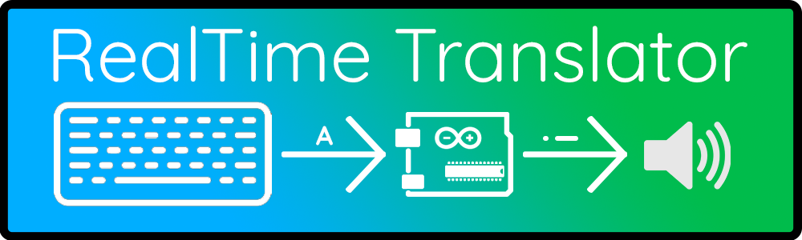

# Realtime morse translator from PS2 keyboard input for Arduino. 

## Needed libraries are bundeled with this realese
+ [ArduinoSTL](https://github.com/mike-matera/ArduinoSTL)
+ [PS2Keyboard](https://github.com/PaulStoffregen/PS2Keyboard)
## When compiling
It may throw some warnings, but if it will compile, there is no need to worry. The warnings are there because the STL lib is old version which contains ***throw*** keyword which is not used in C++ anymore. 

If there will be error with the libs and won't compile, try [removing](https://stackoverflow.com/questions/16752806/how-do-i-remove-a-library-from-the-arduino-environment) and adding back the libs in the Arduino IDE.

# This repositary is for use in VS code with Platform.io
This means if you would like to download the ***.ino** file, go to the [Release](https://github.com/pikachuface/ArduinoMorseTranslator/releases) tab and get it from there.
## Where is the original src file
If you are wondering where is the C++ source file, go to [/src/main.cpp](/src/main.cpp)

